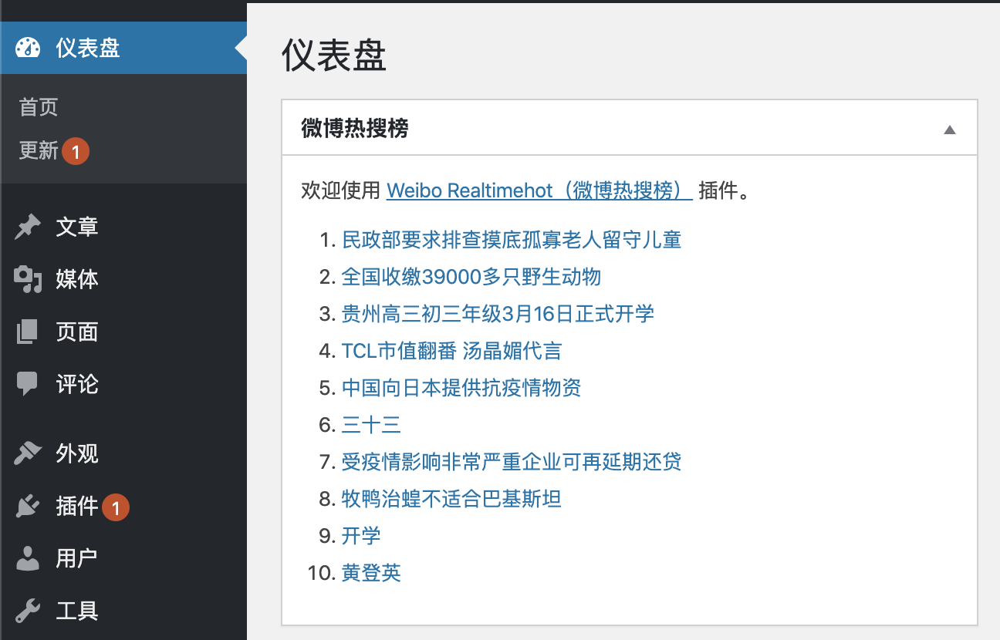
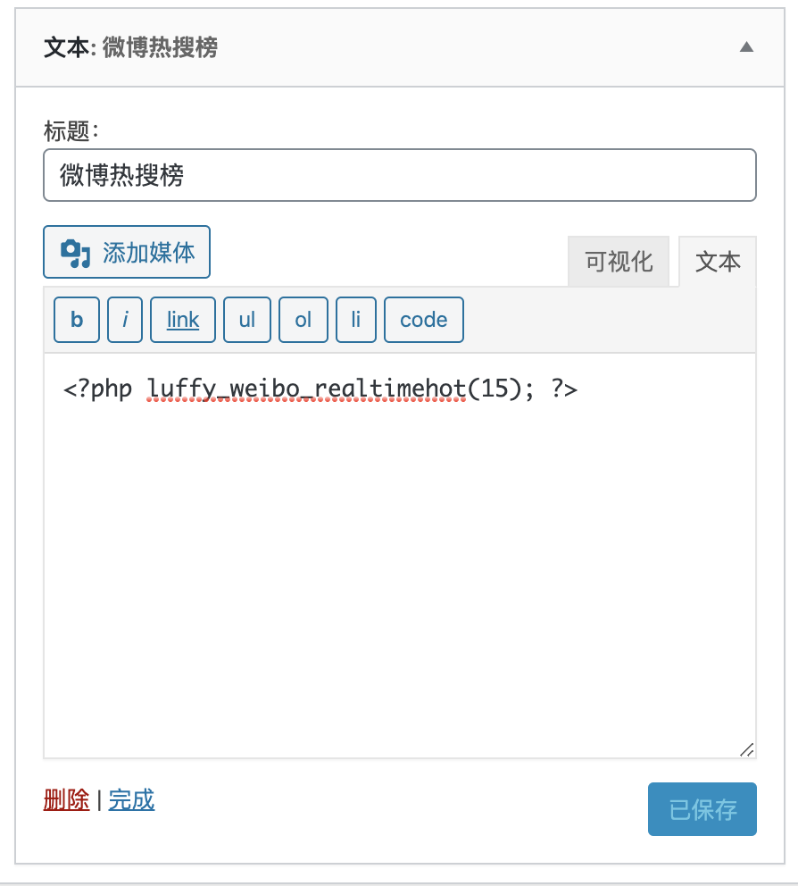
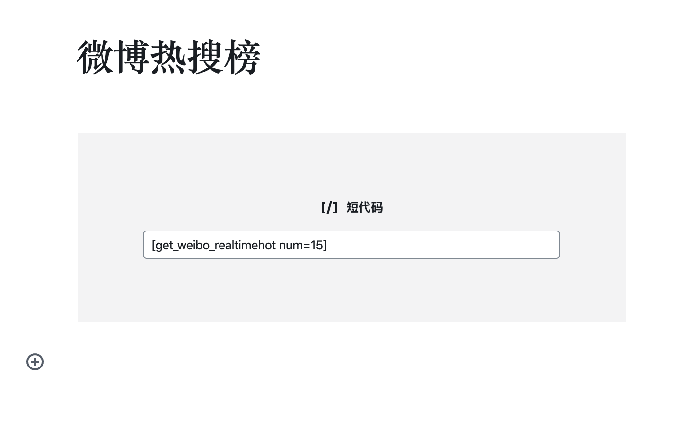

# Realtimehot Weibo（微博热搜榜）

在WordPress的仪表盘、小工具、文章、页面等地方加入微博热搜榜，随时随地 get 实时微博热搜，一键直达！

## 安装

### 后台安装（推荐使用）

在 WordPress 后台安装插件页面搜索 `Realtimehot Weibo`，点击安装

### 下载源码

从 Github 下载源码，通过 WordPress 后台上传安装，或者直接将源码上传到 WordPress 插件目录`wp-content/plugins`

Github 下载节点：[https://github.com/sy-records/realtimehot-weibo/releases/latest](https://github.com/sy-records/realtimehot-weibo/releases/latest)

## 使用

插件无需配置，直接启用后就可以使用。

### 仪表盘

插件启用后，默认在后台仪表盘处添加`微博热搜榜`，如下图



### 小工具

在小工具中使用，需要小工具支持PHP代码执行，插件内部自带此功能。添加一个`文本小工具`，切换到文本模式，写入以下代码

> 默认显示10条热搜，可修改参数来选择显示数量；显示样式受主题控制，默认为数字列表。

```php
<?php luffy_weibo_realtimehot(15); ?>
```



### 文章/页面

插件添加了一个短代码`get_weibo_realtimehot`，来实现在文章或页面中添加热搜内容。使用方式如下

> 默认显示10条热搜，可增加参数`num`来选择显示数量；显示样式受主题控制，默认为数字列表。

#### Gutenberg编辑器

在区块的小工具分类中找到短代码，写入以下内容

```
[get_weibo_realtimehot]
```



#### 经典编辑器

经典编辑器在文本模式中使用短代码，写入以下内容

```
[get_weibo_realtimehot]
```